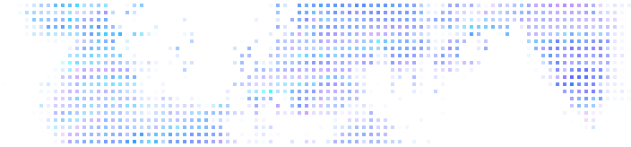

## Orofil

- Software Developer
  - BSc in Computer Science
- Hobbyist photographer and artist 🎨🎵
- From Finland 🇫🇮

I love free (libre) and open source software ([FLOSS](https://www.gnu.org/philosophy/floss-and-foss.en.html)).

Accessibility and sustainable development are very important to me, both in code and elsewhere.

### My projects

[**Wplace Favorites List**](https://github.com/Orofil/wplace-favorites-list)

- Browser extension that improves Wplace by adding saving and browsing of favorite locations on the map.

[**YouTube Video Tagger**](https://github.com/Orofil/youtube-video-tagger)

- Desktop application for saving YouTube playlists and writing notes and tags for videos.

[**About Orofil**](https://github.com/Orofil/about)

- My personal website that's also for improving my web dev skills and trying fun things. 

See the [repositories](https://github.com/Orofil?tab=repositories) tab for more of my projects.

  
More...

### Some of the technologies I have used

  
  ### Statistics from my IDEs

  Doesn't include all coding.

  
  

